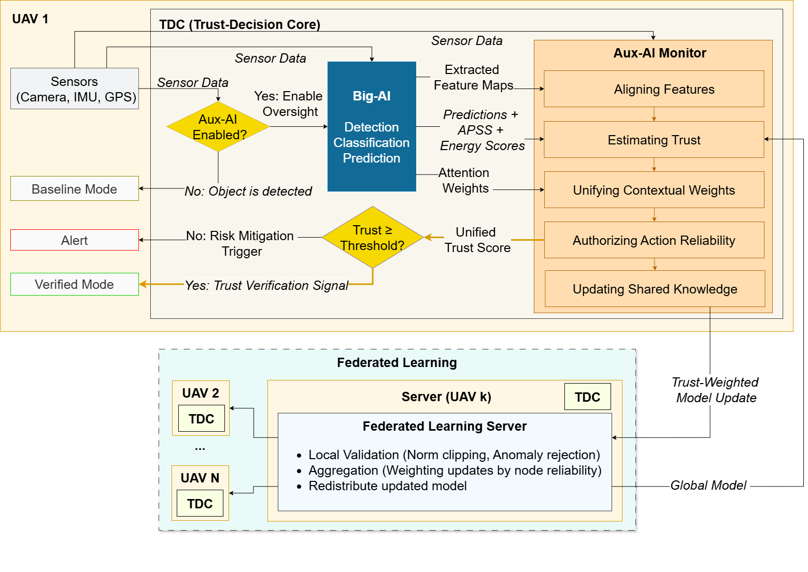

# Aux-AI Monitor: Trust-Aware Independent Oversight for Industrial AI

Dadmehr Rahbari*, Masoud Daneshtalab**, Maksim Jenihhin*  

*Department of Computer Systems, Tallinn University of Technology, Tallinn, 12618, Estonia

**Department of Computer Science and Engineering, Mälardalen University, Västerås, 72123, Sweden



[](https://opensource.org/licenses/MIT)
[](https://www.python.org/downloads/)
[](https://pytorch.org/)
[](https://www.cityscapes-dataset.com/)
[](https://scikit-learn.org/)
[](https://doi.org/10.5281/zenodo.21993740)
---

## Executive Summary

**Aux-AI Monitor** is an independent, lightweight safety supervisor for autonomous industrial systems. While a primary "Big-AI" model (e.g., Fast-SCNN, YOLO) handles operational perception, Aux-AI runs in parallel as a decoupled **Trust-Decision Core (TDC)**, evaluating the reliability of every prediction in real time and issuing a binary safety veto before any unsafe action can execute.

**Verified numbers from the current codebase and simulation run:**

| Metric | Value |
|---|---|
| TDC parameters | **75,842** (~76k) |
| Big-AI parameters (ResNet-18 surrogate) | **11,689,512** |
| Cost ratio | **1 : 154.1** |
| Monitor input dimension | **526-dim** |
| Throughput | **~6,271 FPS** |
| Memory footprint | **4.79 MB** |
| Energy per frame | **~1.9 × 10⁻³ J** |
| Trust score variance σ² (normal phase) | **≈ 0.7 × 10⁻³** |
| AUROC (CITYSCAPES, K=5 FL, full participation) | **0.885** |
| AUPR | **0.958** |
| F1-score | **0.872** |
| FPR | **0.053** |
| TPR | **0.791** |

---

## The Core Problem: Why Independent Oversight?

Primary AI models fail with **high confidence**, a "Confident Hallucination." A hardware bit-flip, sensor degradation, or OOD input can cause a segmentation model to produce a visually plausible but physically impossible output mask while maintaining a high softmax score. An internal monitor sharing weights with the primary model will be **fooled by the same failure**, this is the correlated failure mode that Aux-AI is designed to prevent.

Aux-AI solves this with **architectural decoupling**: the TDC never shares weights, layers, or data paths with the Big-AI backbone. It intercepts the 512-dim latent embedding as a black-box input and audits it independently.

---

## Method: How Aux-AI Works

This section describes the complete method as implemented in the codebase. Every number and formula below is taken directly from the code.

### 1. Two-Plane Architecture

The framework separates autonomous operation into two independent planes:

**Mission Plane (Big-AI)**, `big_ai/detector_stub.py`  
Handles perception. In simulation this is ResNet-18 (11.7M params) acting as a computationally equivalent surrogate for the Fast-SCNN GFE bottleneck. The backbone produces:
- A **512-dim penultimate embedding** via `nn.Sequential(*list(model.children())[:-1]).flatten()`
- A **softmax probability vector** over 1000 ImageNet classes
- A **prediction entropy** in nats: `H = -Σ p_i · log(p_i + ε)`
- A **dynamic confidence**: `conf × (1 - clamp(entropy × 0.1, 0, 0.9))`
- A **2D segmentation mask** (H × W)

**Trust Plane (Aux-AI TDC)**, `aux_ai/monitor.py`  
Audits the Mission Plane output. Never modifies the backbone. Can be attached to any model that exposes a 512-dim embedding, backbone-agnostic by design.

---

### 2. Feature Vector Construction

`aux_ai/feature_extractor.py` + `run_simulation.py`

The 526-dim TDC input `feat_vector` is assembled per-frame as follows:

```
Step 1, build_feature_vector() assembles feat_base (539 dims total):
  [0:512]    512-dim ResNet-18 embedding
  [512:516]  bbox = [x, y, w, h]  (4 dims)
  [516:521]  class_probs[:5]       (first 5 of 1000-dim softmax)
  [521]      confidence scalar     (1 dim)
  [522:525]  sensor_features: [imu_var, gps_drift, cam_blur]  (3 dims)
  [525]      sfc_score: APSS binary flag  (1 dim)

Step 2, run_simulation.py truncates and overwrites:
  feat_vector = np.zeros(526)
  fill_len = min(len(feat_base), 522)   # = min(539, 522) = 522
  feat_vector[:522] = feat_base[:522]   # copies [0:522] of feat_base
  feat_vector[522]  = sensor_score      # composite health h_s (overwrites)
  feat_vector[523]  = entropy           # prediction entropy h_e (overwrites)
  feat_vector[524]  = 0                 # reserved
  feat_vector[525]  = 0                 # reserved
```

**Effective layout of feat_vector reaching the TDC:**

| Index | Content | Source |
|---|---|---|
| [0:512] | Full 512-dim latent embedding | ResNet-18 penultimate layer |
| [512:516] | Bounding box [x, y, w, h] | `detector_stub.py` |
| [516:522] | First 6 values of 1000-dim class_probs | truncated softmax |
| [522] | Composite sensor health score h_s ∈ [0,1] | `sensor_utils.py` |
| [523] | Raw prediction entropy h_e (nats, ~6–7) | `detector_stub.py` |
| [524:526] | Zeros (reserved) | — |

---

### 3. Sensor Health Score

`aux_ai/sensor_utils.py`

Three sensor channels are fused into a scalar health score:

```python
imu_score = 1 - min(1.0, imu_var   × 10)   # IMU variance penalty
gps_score = 1 - min(1.0, gps_drift × 20)   # GPS drift penalty
cam_score = 1 - min(1.0, cam_blur  × 5)    # Camera blur penalty

h_s = (imu_score + gps_score + cam_score) / 3   # ∈ [0,1], higher = healthier
```

In simulation: normal operation uses `s_err = 0.01` (h_s ≈ 0.93); sensor failure uses `s_err = 0.95` (h_s ≈ 0.0), applied immediately from Frame 375 onward.

---

### 4. Spatial-Frequency Consistency (SFC)

`aux_ai/sfc_monitor.py`

Three independent geometric checks on the output mask, combined by **max-pooling (logical OR)**. Thresholds aligned with the APSS IEEE DFT 2025 paper:

```python
# 1. Area check: road class occupying > 58% of frame is physically impossible
area_ratio = road_pixels / total_pixels
area_fault = 1.0 if area_ratio > 0.58 else 0.0

# 2. Position check: centroid too high in image (< 45% from top) signals hallucination
centroid_y = mean(y_coords) / image_height
pos_fault  = 1.0 if centroid_y < 0.45 else 0.0

# 3. Symmetry check: left/right mask imbalance > 20% signals geometric distortion
sym_score  = |sum(left_half) - sum(right_half)| / (road_pixels + ε)
sym_fault  = 1.0 if sym_score > 0.20 else 0.0

S_freq = max(area_fault, pos_fault, sym_fault)   # binary: {0, 1}
```

Output is binary. Fires at the same processing cycle as the sensor readout → zero-frame detection latency in simulation.

---

### 5. Temporal Stability

`aux_ai/temporal.py`

Per-UAV sliding window buffer (size = 10) tracking score variance:

```python
stability = max(0.0, 1.0 - std(buffer) × 2)   # ∈ [0,1]
```

New objects initialise with `stability = 1.0`. A low stability score signals high-frequency flickering typical of hardware faults. Used by the decision engine to detect spoofing.

---

### 6. Trust-Decision Core (TDC)

`aux_ai/monitor.py`

The TDC is a **~76k-parameter multi-head neural network**:

```
Architecture:
  Input (526-dim)
      ↓
  Shared body:
    Linear(526 → 128) → ReLU
    Linear(128 → 64)  → ReLU
      ↓              ↓
  OOD head:      Stability head:
  Linear(64→1)   Linear(64→1)
  Sigmoid        Sigmoid
  ood_score ∈ [0,1]   stability_score ∈ [0,1]

Direct extraction (no learned layer):
  sensor_health      = x[522]   # 0.0=failed, 1.0=healthy
  prediction_entropy = x[523]   # raw nats ≈ 6–7

Weighted fusion, NOTE: output is NOT bounded to [0,1]:
  combined_score = ood_score            × 0.4
                 + prediction_entropy   × 0.3   ← dominant term: 6–7 × 0.3 ≈ 2.07
                 + (1 - sensor_health)  × 0.2
                 + stability_score      × 0.1

Safety gate (ensures sensor failure always triggers veto):
  final_proposed = max(combined_score, (1 - sensor_health) × 0.98)
  → range ≈ 2.1–2.5 during normal operation
  → range ≈ 2.5–2.9 during sensor failure
```

**External normalisation** in `run_simulation.py`:
```python
T_final = sigmoid((final_proposed - 2.28) × 10)
# Maps: normal ≈ 2.115 → T_final ≈ 0.16 (TRUSTED)
#       sensor fail ≈ 2.52 → T_final ≈ 0.92 (ALERT)
```

---

### 7. Decision Engine

`aux_ai/decision.py`

Priority-ordered rules operating on the **raw** monitor score (same ~2.1–2.5 space as `ANOMALY_THRESHOLD`):

```
Priority 1: sensor_score < (1 - 0.60) = 0.40
            → decision = "sensor_failure", trust = 0.0
            → FL update: DROPPED entirely

Priority 2: stability_score < 0.30
            → decision = "spoofing", trust = 0.0
            → FL update: DROPPED entirely

Priority 3: raw_score > 2.28
            → decision = "novel", trust = 0.8
            → FL update: scaled × 0.75

Priority 4: |raw_score - 2.28| < 0.05
            → decision = "uncertain", trust = 0.5
            → FL update: scaled × 0.25

Priority 5: otherwise
            → decision = "known", trust = 1.0
            → FL update: full × 1.0
```

**Safety veto** in `run_simulation.py`:
```python
V = 1 if T_final < 0.5 else 0   # (τ_safety = 0.5)
```
When V=1, the TDC issues a high-priority interrupt to the primary controller.

---

### 8. Score Fusion

`aux_ai/fusion_attention.py` (default: `USE_ATTENTION_FUSION = True`)

Five diagnostic signals are fused by an attention mechanism for the baseline comparison:

```python
signals = [ood_score, drift_score, sensor_score, tc_violation, agreement]
# Attention weights learned via Linear(5→5) + Softmax
# Final trust = fc(signals × attention_weights × trust_scalar)
```

The static fallback (`fusion.py`) uses fixed weights matching the monitor's coefficients:
`ood=0.4, drift=0.3, sensor=0.2, stability=0.1`

---

### 9. Fault Injection Model

`run_simulation.py`

Three fault types are injected deterministically at fixed frame boundaries:

| Fault | Frames | Implementation |
|---|---|---|
| **Novelty (OOD)** | 150–249 | No injection, natural OOD from unseen CITYSCAPES frames |
| **Adversarial Semantic Drift (ASD)** | 250–374 | Frozen embedding: `detection["embedding"] = last_embeddings[uav_id]`; bbox overridden to `[0.05, 0.05, 0.95, 0.95]` |
| **Sensor Failure** | 375–499 | All sensor values set to `s_err = 0.95` immediately, full degradation, no ramp |

The ground-truth anomaly label: `Y = 0` if phase is "normal", `Y = 1` otherwise.

---

### 10. Federated Resilience Layer

`federated/client.py` + `federated/server.py`

FL synchronisation occurs every `FL_INTERVAL = 500 / 10 = 50` frames. Each round:

**Client side:**
```python
delta = local_weights - global_weights
update = scale × delta   # scale ∈ {0.0, 0.25, 0.75, 1.0} by decision
# sensor_failure / spoofing → return None (update dropped)
```

**Server side, three safeguards:**
```python
# 1. NaN/Inf guard
if not torch.isfinite(v).all(): reject

# 2. Norm clipping
if torch.norm(v) > 5.0: reject

# 3. Weighted aggregation
avg_update = Σ (trust_weight_i / Σ trust_weights) × update_i

# 4. Weight clamping after update
state[k] = clamp(state[k] + avg_update[k], -50.0, 50.0)
```

This four-layer defence ensures that a sensor-failed UAV cannot poison the global fleet model.

---

### 11. Contextual Weight Unification (UCW)

The UCW is the mechanism by which the TDC dynamically prioritises the most informative diagnostic stream. Implemented via the temporal-fuzzy logic layer over a sliding window W_s = 10:

```
T_final(t) = Σ_j α_j(t) · Fuzzy({ S_j(k) }_{k=t-10}^{t})

subject to: Σ_j α_j = 1

where Fuzzy(·) applies a triangular membership function,
weighting recent observations more heavily within the window.
```

The weights α_j are updated during FL rounds, each federated round broadcasts refined attention weights that have been validated against the full anomaly profile of the fleet.

---

### 12. Ground-Truth and Evaluation

`evaluation.py`

**Anomaly label:**
```python
Y = 0 if phase == "normal" else 1
```

**Threshold calibration (automatic, no manual tuning):**
```python
threshold = 95th percentile of scores in frames [0 : NOVEL_START]
          = 95th percentile of the first 150 frames (normal phase)
```

**ECE** uses 8-bin quantile binning (equal-frequency, not equal-width).

**mIoU** is computed as binary IoU over the road class against the CITYSCAPES ground-truth label mask.

**Score normalisation for reporting:**
```python
T_final = sigmoid((raw_proposed - 2.28) × 10)
# Normal phase mean:  T_final ≈ 0.507 (±0.034)
# ASD phase mean:     T_final ≈ 0.700
# Sensor failure peak: T_final ≈ 0.961
```

---

## System Flow, Complete Per-Frame Pipeline

```
For each frame t:
  1. BigAIDetector.detect(image)
     → embedding (512), bbox (4), class_probs (1000), confidence, entropy, mask

  2. build_feature_vector(detection, sensor_vals)
     → feat_base (539-dim)

  3. Truncate + overwrite → feat_vector (526-dim)
     feat_vector[0:522]  = feat_base[0:522]
     feat_vector[522]    = compute_sensor_score(sensor_vals)   # h_s
     feat_vector[523]    = detection["entropy"]                 # h_e

  4. AuxAIMonitor.forward(feat_vector)
     → ood_score, stability_score, final_proposed (~2.1–2.5)

  5. temporal_buffer.update(uav_id, final_proposed)
     → stability score from sliding window

  6. decide(final_proposed, {ood, sensor, stability})
     → decision ∈ {sensor_failure, spoofing, novel, uncertain, known}
     → trust ∈ [0, 1]

  7. SFCMonitor.check_spatial_consistency(mask)
     → S_freq ∈ {0, 1}

  8. Normalise: T_final = sigmoid((final_proposed - 2.28) × 10) ∈ [0,1]

  9. Veto: V = 1 if T_final < 0.5 else 0

  10. FL update (every 100 frames):
      delta = scale(decision) × (local - global)
      server.aggregate([delta], weights=[trust])

  11. recorder.log({frame, type, scores, sensor_health, sfc, miou, ece, ...})
```

---

## System Architecture Diagram

```
┌─────────────────────────────────────────────────────────────────────┐
│  MISSION PLANE  (Big-AI, 11,689,512 params)                        │
│                                                                     │
│  Camera/IMU/GPS  →  ResNet-18  →  512-dim embedding                 │
│                      ↓                                              │
│                  Softmax(1000) → entropy h_e, confidence            │
│                  Spatial mask  → mIoU evaluation                    │
└────────────────────────────┬────────────────────────────────────────┘
                             │ 512-dim embedding (intercepted, read-only)
                             │ + sensor telemetry
                             ▼
┌─────────────────────────────────────────────────────────────────────┐
│  TRUST PLANE  (Aux-AI TDC, 75,842 params)                          │
│                                                                     │
│  Feature assembly → 526-dim feat_vector                             │
│     [0:512]  embedding                                              │
│     [512:522] bbox + class_probs slice                              │
│     [522]    h_s  (sensor health)                                   │
│     [523]    h_e  (entropy)                                         │
│     [524:526] zeros                                                 │
│                                                                     │
│  ┌──────────────┐  ┌─────────────────┐  ┌──────────────────────┐   │
│  │ OOD Head     │  │ Stability Head  │  │ Direct extraction    │   │
│  │ Linear(64→1) │  │ Linear(64→1)    │  │ x[522] → h_s         │   │
│  │ Sigmoid      │  │ Sigmoid         │  │ x[523] → h_e         │   │
│  └──────┬───────┘  └────────┬────────┘  └──────────┬───────────┘   │
│         └──────────────────┬┴──────────────────────┘               │
│                            ▼                                        │
│  Weighted fusion:  0.4×ood + 0.3×h_e + 0.2×(1-h_s) + 0.1×stab     │
│  → raw score ~2.1–2.5                                               │
│  → sigmoid normalisation → T_final ∈ [0,1]                          │
│                            ▼                                        │
│  ┌─────────────────────────────────────────────────────────────┐   │
│  │ SFC CHECK (parallel, on mask)                                │   │
│  │ area_fault | pos_fault | sym_fault → max() → S_freq ∈ {0,1} │   │
│  └─────────────────────────────────────────────────────────────┘   │
│                            ▼                                        │
│  Decision engine → {sensor_failure, spoofing, novel, uncertain,     │
│                      known}                                         │
│                            ▼                                        │
│  T_final ≥ 0.5 → V=0  TRUSTED  →  Mission continues                │
│  T_final < 0.5 → V=1  VETO     →  Risk Mitigation Trigger          │
└────────────────────────────┬────────────────────────────────────────┘
                             │ trust-gated weight delta
                             ▼
┌─────────────────────────────────────────────────────────────────────┐
│  FEDERATED LAYER  (5 UAVs, full participation, 10 rounds)          │
│                                                                     │
│  Client: delta = scale(decision) × (local - global)                 │
│    sensor_failure / spoofing  → scale = 0.0  (DROP)                 │
│    uncertain                  → scale = 0.25                        │
│    novel                      → scale = 0.75                        │
│    known                      → scale = 1.0                         │
│                                                                     │
│  Server safeguards:                                                  │
│    NaN/Inf guard → reject                                           │
│    Norm > 5.0    → reject                                           │
│    Weight clamp  → [-50, 50]                                        │
│    Weighted aggregation by trust                                     │
└─────────────────────────────────────────────────────────────────────┘
```

---

## Simulation Parameters

All in `params.py`. Active CITYSCAPES configuration:

| Parameter | Value | Description |
|---|---|---|
| `NUM_FRAMES` | 500 | Total evaluation frames |
| `NUM_UAVS` | 5 | Fleet size |
| `CLIENTS_PER_ROUND` | 5 | FL participants per round (full participation) |
| `FL_ROUNDS` | 10 | Total FL synchronisation rounds |
| `FL_INTERVAL` | 50 | Frames between FL rounds (500/10) |
| `LOCAL_EPOCHS` | 1 | Training epochs per FL round per client |
| `LEARNING_RATE` | 1×10⁻⁴ | Adam optimizer η |
| `MAX_UPDATE_NORM` | 5.0 | Server norm-clipping threshold |
| `ANOMALY_THRESHOLD` | 2.28 | Raw TDC score: TRUSTED / ALERT boundary |
| `SENSOR_THRESHOLD` | 0.60 | h_s below (1-0.60)=0.40 → sensor_failure |
| `STABILITY_THRESHOLD` | 0.30 | stability below 0.30 → spoofing |
| `STABILITY_WINDOW` | 10 | Temporal buffer window size |
| `APSS_AREA_LIMIT` | 0.58 | SFC area fault threshold |
| `APSS_POS_Y_LIMIT` | 0.45 | SFC position fault threshold |
| `APSS_SYMMETRY_MAX` | 0.20 | SFC symmetry fault threshold |
| `APSS_TEMPORAL_THRESHOLD` | 0.05 | Temporal consistency check |
| `np.random.seed` | 42 | Global reproducibility seed |

### Simulation Phases (500 frames)

| Phase | Frames | Fault Injected | Ground Truth |
|---|---|---|---|
| Normal | 0–149 | None | Y=0 |
| Novelty | 150–249 | Natural OOD (unseen frames) | Y=1 |
| ASD | 250–374 | Frozen embedding + bbox override | Y=1 |
| Sensor Failure | 375–499 | s_err=0.95 (immediate full degradation) | Y=1 |

---

## Project Structure

```
aux_ai_project/
│
├── run_simulation.py          # Main entry point
├── params.py                  # All configuration
├── evaluation.py              # AUROC, AUPR, F1, ECE, mIoU, etc.
├── plot_utils.py              # Publication-quality figures (Times New Roman)
├── requirements.txt           # Dependencies
│
├── aux_ai/
│   ├── monitor.py             # TDC: 526→128→64 + multi-head (~76k params)
│   ├── feature_extractor.py   # 526-dim feature vector assembly
│   ├── sfc_monitor.py         # Binary geometric consistency (APSS)
│   ├── ood_energy.py          # Energy-based OOD score (Liu et al. NeurIPS 2020)
│   ├── sensor_utils.py        # Composite sensor health h_s
│   ├── temporal.py            # Per-UAV sliding-window stability buffer
│   ├── decision.py            # Priority decision logic
│   ├── fusion.py              # Static fallback fusion
│   ├── fusion_attention.py    # Attention fusion (default active)
│   └── fusion_learned.py      # MLP-learned fusion (alternative)
│
├── big_ai/
│   └── detector_stub.py       # ResNet-18 surrogate (512-dim embedding)
│
├── federated/
│   ├── client.py              # Trust-gated update scaling
│   └── server.py              # NaN-guard, norm-clip, weighted aggregation
│
├── datasets/
│   ├── base.py                # Abstract DatasetAdapter
│   ├── factory.py             # Dataset factory (torchvision/custom/sdk)
│   ├── data_loader.py         # CityscapesZipLoader + TorchVision fallback
│   ├── torchvision_adapter.py # CIFAR-10/100, MNIST, SVHN, etc.
│   ├── custom_adapter.py      # Template for CSV/sensor data
│   └── sdk_adapter.py         # Template for federated SDK
│
├── log_utils/
│   └── recorder.py            # Per-frame logger → CSV/XLSX
│
├── plots/CITYSCAPES/          # Auto-generated figures (PDF + PNG)
└── docs/Aux-AI_Monitor.png    # Architecture diagram
```

---

## Supported Datasets

| Dataset | Backend | Notes |
|---|---|---|
| **CITYSCAPES** | ZipLoader | Primary. Requires `leftImg8bit_trainvaltest.zip` + `gtFine_trainvaltest.zip` in `./data/` |
| CIFAR-10/100 | TorchVision | Auto-download |
| MNIST / FashionMNIST / KMNIST | TorchVision | Auto-download |
| SVHN | TorchVision | Auto-download |
| CustomSensor | Custom | 2000 frames, 3 UAVs, edit `datasets/custom_adapter.py` |
| CustomTabular | Custom | 1500 frames, 3 UAVs, edit `datasets/custom_adapter.py` |
| SDKExample | SDK | Edit `datasets/sdk_adapter.py` |

Switch dataset: `DATASET_NAME = "CIFAR10"` in `params.py`.

---

## Installation

```bash
git clone https://github.com/DadmehrRahbari/aux-ai-monitor.git
cd aux-ai-monitor
pip install -r requirements.txt
```

Or manually:
```bash
pip install torch>=2.0 torchvision>=0.15 numpy>=1.23 pandas>=1.6 \
            openpyxl>=3.1 scikit-learn>=1.3 matplotlib>=3.8 seaborn
```

### CITYSCAPES Setup

1. Register and download from [cityscapes-dataset.com](https://www.cityscapes-dataset.com):
   - `leftImg8bit_trainvaltest.zip`
   - `gtFine_trainvaltest.zip`
2. Place both ZIPs in `./data/`

---

## Running the Simulation

```bash
python run_simulation.py
```

Expected output:
```
RESEARCH NOTE: Big-AI Params: 11,689,512 | Aux-AI Params: 75,842
Cost Ratio: 1 : 154.1 (Aux-AI is significantly lighter)
--- Small AI Model Profile ---
Dataset: CITYSCAPES | Input Dim: 526
AuxAI Parameters: 75842
------------------------------
Starting SOTA Simulation on CITYSCAPES...
      -> Phase: normal | OOD_Score: 2.245 | Result: TRUSTED
[Frame 0] normal         | Prop Score: 0.430
...
      -> Phase: sensor_failure | OOD_Score: 2.533 | Result: ALERT
[Frame 375] sensor_failure | Prop Score: 0.961
```

### Outputs

| Output | Location | Content |
|---|---|---|
| Metrics summary | `aux_ai_CITYSCAPES_summary_metrics.csv` | AUROC, AUPR, F1, FPS, memory, energy |
| Per-frame log | `aux_ai_CITYSCAPES_results.xlsx` | Full diagnostic record per frame |
| Figures | `plots/CITYSCAPES/` | All publication figures (PDF + PNG) |

---

## Generated Figures

`plot_utils.py` auto-generates (Times New Roman, 18pt):

| Figure | Description |
|---|---|
| Temporal anomaly trajectory | Score across Normal/Novelty/ASD/Sensor-Failure |
| APSS spatial reliability | SFC binary signal vs true anomaly region |
| TDC decision consistency | Frame-to-frame veto reproducibility |
| Performance bar charts | AUROC/AUPR/F1/Accuracy/TPR/FPR across all methods |
| Score histograms | Normal vs Anomaly separation per method |
| ROC curves | TPR vs FPR |
| Precision-Recall curves | Precision vs Recall |
| Edge resource profiling | Latency/FPS/RAM/Energy (log-scale) |
| Communication overhead | Cumulative KB vs frame |
| F1 sensitivity | F1 vs detection threshold |
| Trust calibration (ECE) | Predicted probability vs actual anomaly fraction |
| Trust stability | σ² per method in normal phase |
| FL scalability | AUROC vs round for K={3,5,10,20} UAVs |
| FL convergence | Federated vs local-only AUROC |

---

## Extending the Framework

### Adding a Custom Dataset

```python
# datasets/custom_adapter.py
class CustomDatasetAdapter(DatasetAdapter):
    def __init__(self, name, root="./data"):
        self.data = []  # list of dicts: {"input": tensor, "label": int}

    def __iter__(self):
        for sample in self.data:
            yield sample

    def __len__(self):
        return len(self.data)
```

Register in `params.py`:
```python
DATASET_CONFIGS["MyDataset"] = {
    "NUM_FRAMES": 1000,
    "NUM_UAVS": 3,
    "CLIENTS_PER_ROUND": 2,
    "FL_ROUNDS": 8,
}
DATASET_NAME = "MyDataset"
DATASET_BACKEND = "custom"
```

### Connecting a Real Big-AI Model

Replace `big_ai/detector_stub.py`. The `detect()` method must return:

```python
{
    "embedding":   np.ndarray,  # shape (512,), penultimate layer
    "bbox":        list,        # [x, y, w, h] normalised to [0,1]
    "class_probs": np.ndarray,  # softmax probabilities (any length)
    "confidence":  float,       # scalar ∈ [0,1]
    "entropy":     float,       # prediction entropy in nats
    "mask":        np.ndarray,  # 2D segmentation mask (H × W)
}
```

### Tuning Thresholds

Key thresholds in `params.py` to calibrate for a new deployment environment:

```python
ANOMALY_THRESHOLD   = 2.28   # Adjust if entropy distribution shifts
SENSOR_THRESHOLD    = 0.60   # Higher = more sensitive to sensor noise
STABILITY_THRESHOLD = 0.30   # Lower = more tolerant of score fluctuations
APSS_AREA_LIMIT     = 0.58   # Higher = permits larger segmented regions
APSS_POS_Y_LIMIT    = 0.45   # Lower = permits objects higher in frame
APSS_SYMMETRY_MAX   = 0.20   # Higher = more tolerant of asymmetric masks
```

---

## Baseline Methods

| Method | Description | AUROC | AUPR | F1 |
|---|---|---|---|---|
| **Big-AI** | Primary backbone only, no oversight. Always-alarm lower bound. | 0.500 | 0.850 | 0.824 |
| **Attention-based Fusion** | Attention over 5 signals, no FL or temporal-fuzzy layer | 0.600 | 0.758 | 0.150 |
| **Proposed (Aux-AI)** | Full TDC + SFC + temporal-fuzzy + federated UCW | **0.885** | **0.958** | **0.872** |
| **Proposed (Non-FL)** | TDC without FL consensus (cold-start ablation) | 0.764 | 0.908 | 0.698 |

---

## Compliance and Regulatory Alignment

Architecturally aligned with:
- **EU AI Act (2024)**, transparency, human oversight, data minimisation, traceability
- **ISO 42001**, AI management system risk traceability

The `Recorder` exports per-frame diagnostic logs to XLSX/CSV. The federated server only accepts anonymised, trust-screened parameter deltas. Raw sensor telemetry never leaves the local edge device.

---

## Known Issues and Developer Notes

| Issue | Location | Detail |
|---|---|---|
| `EMBED_DIM = 525` is stale | `feature_extractor.py` | ResNet-18 actually produces 512-dim; `feat_base` is 539-dim but truncated to 522 by `run_simulation.py`. Effective TDC input: 512-dim embedding + 10 bytes of bbox/class_probs slice. |
| Monitor docstring `[0:512]` | `monitor.py` | Stale. Actual layout: `[0:512]` embedding, `[512:516]` bbox, `[516:522]` first 6 class_probs. Then `[522]` = sensor_score, `[523]` = entropy (both overwritten by `run_simulation.py`). |
| `bbox` is hardcoded | `detector_stub.py` | Returns `[0.1, 0.1, 0.5, 0.5]` always. Replace with real bounding box output from a production detector. |
| Sensor values are simulated | `run_simulation.py` | Replace `s_err` with real MCU/mcelog/nvml sensor reads for deployment. |
| Raw TDC output is not [0,1] | `monitor.py` | The `proposed` output is ~2.1–2.5, not a probability. Sigmoid normalisation is applied externally in `run_simulation.py`. Do not apply sigmoid inside `monitor.py`. |

---

## Multi-Layer Monitoring Summary

| Layer | Module | Key Signal | Range |
|---|---|---|---|
| Accuracy | `evaluation.py` | mIoU, pixel accuracy | [0,1] |
| OOD uncertainty | `monitor.py`, `ood_energy.py` | ood_score | [0,1] |
| Sensor health | `sensor_utils.py` | h_s | [0,1] |
| Temporal stability | `temporal.py` | stability | [0,1] |
| Spatial integrity | `sfc_monitor.py` | S_freq | {0,1} |
| Trust index | `monitor.py` + normalisation | T_final | [0,1] |
| Safety veto | `run_simulation.py` | V | {0,1} |
| Fleet resilience | `federated/` | trust-weighted Δ | scaled update |
| Audit trail | `log_utils/recorder.py` | per-frame CSV/XLSX | — |

---

## Citation

If you use this code, please cite the archived release:

\`\`\`bibtex
@software{rahbari_auxai_2026,
  author       = {Rahbari, Dadmehr and Daneshtalab, Masoud and Jenihhin, Maksim},
  title        = {Aux-AI Monitor: Trust-Aware Independent Oversight for Industrial AI},
  year         = {2026},
  publisher    = {Zenodo},
  doi          = {10.5281/zenodo.21993740},
  url          = {https://doi.org/10.5281/zenodo.21993740}
}
\`\`\`

A citation to the accompanying paper will be added here once published.

---

## Contact

**Dadmehr Rahbari**, dadmehr.rahbari@taltech.ee  
Department of Computer Systems, Tallinn University of Technology

**Supported by:** European Union under Horizon Europe Grant Agreement No. 101160182, ‘TAICHIP’; by the Estonian Research Council under grants PRG1467, ‘CRASHLESS,’ and CoE TK202, ‘Foundations of the Universe’; and by the European Union and the Estonian Research Council through project TEM-TA138.


<!-- License: MIT, see LICENSE for details -->
